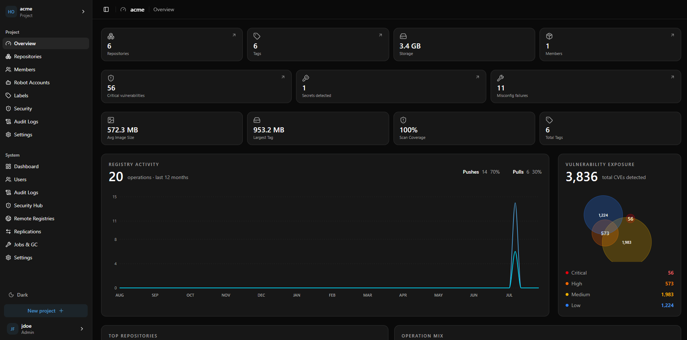
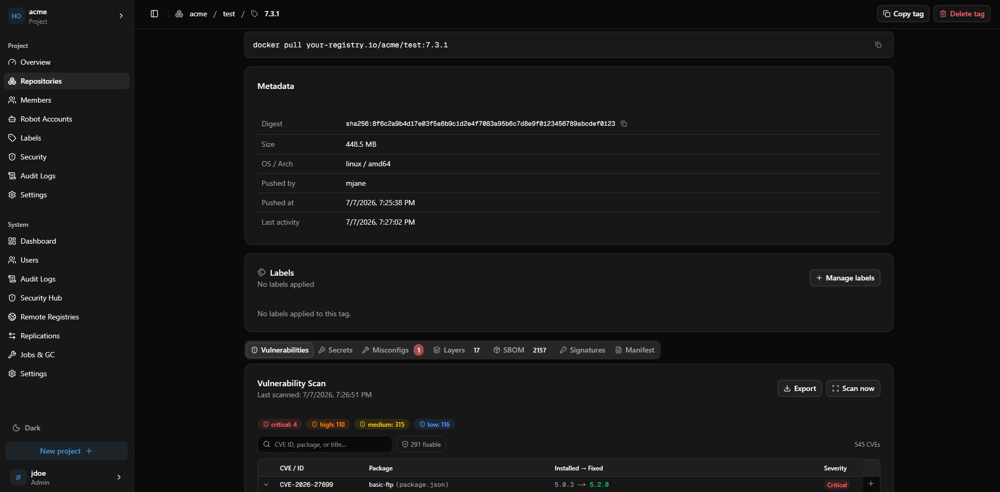

 &nbsp;**Siene**

A self-hostable container registry UI for small to mid-sized engineering teams. Siene sits on top of [Docker Distribution v3](https://github.com/distribution/distribution) and adds the project management, security scanning, and access control that the raw registry lacks - without the operational complexity of Harbor.




## Features

- **Projects** - namespace isolation with per-project storage quotas and public/private visibility
- **RBAC** - four roles per project: guest, developer, maintainer, admin
- **Robot accounts** - scoped service accounts for CI/CD pipelines
- **Personal access tokens** - tokens for API and `docker login` access
- **Multi-arch images** - manifest list (OCI index) support; each platform child is stored, scanned, and displayed independently; index tags show a platforms card with per-arch scan status
- **Vulnerability scanning** - automatic Trivy scans on push; per-severity pull prevention; CVE allowlist; scheduled re-scanning for all platforms
- **Secret and misconfiguration scanning** - automatic on push for every platform; configurable pull prevention thresholds
- **SBOM** - automatic Syft SPDX generation on push; browsable package list with license breakdown
- **Image signing** - Cosign v2 and Notation v1 verification with optional pull enforcement
- **Replication** - push/pull rules to 11 remote registry providers including Docker Hub, GHCR, ECR, GCR, ACR, Harbor, and JFrog
- **Audit log** - every push, pull, delete, and admin action recorded; filterable and configurable retention
- **Garbage collection** - scheduled or manual; removes orphaned blobs and enforces tag retention rules
- **OIDC SSO** - tested with Keycloak, Authelia, and Authentik
- **Dark and light theme**

## Requirements

- Docker Engine 24+
- Docker Compose v2.24+

### System specifications

Minimum and recommended specs depend on whether security scanning is enabled. Scanning is the dominant resource consumer: Trivy and Syft decompress every image layer into memory during analysis, so peak RAM scales with the **uncompressed** size of the largest image you push — which is typically 2–4× the compressed size you see on disk.

**Without scanning (registry + UI only)**

| | Minimum | Recommended |
|---|---|---|
| CPU | 2 cores | 4 cores |
| RAM | 2 GB | 4 GB |
| Disk | Image storage + 10 GB overhead | Image storage + 20 GB overhead |

**With scanning enabled**

| Largest image (compressed) | Peak scan RAM | Recommended host RAM |
|---|---|---|
| Up to 200 MB (Alpine, slim images) | ~1 GB | 4 GB |
| Up to 500 MB (Debian/Ubuntu apps) | ~2 GB | 6 GB |
| Up to 1 GB (JVM, Node, Python apps) | ~4 GB | 8 GB |
| Up to 2 GB (data-science, ML images) | ~6 GB | 12 GB |
| Up to 4 GB (PyTorch, CUDA, Spark) | ~10–12 GB | 16–24 GB |

Peak scan RAM is the Trivy subprocess RSS. One scan runs at a time (`--concurrency 1`). If a scan exceeds available memory the kernel OOM-kills the worker container; Docker restarts it automatically (`restart: always`). The unacknowledged task is redelivered from the Redis queue after a 1-hour visibility timeout and will run again — but if the image is simply too large for available RAM it will OOM-kill on every attempt. Set a `mem_limit` large enough for your biggest image, or disable scanning for projects with images that exceed your available RAM.

> [!TIP]
> You can add `mem_limit` and `memswap_limit` to `siene-worker-scans` and `siene-worker-sbom` in your compose file to cap their memory and prevent scan spikes from starving other services. See the commented examples in the compose files. Setting `memswap_limit` equal to `mem_limit` disables swap for those containers — an OOM kill and clean retry is faster than swap thrash.

## Deployment

Run the setup script from the repository root:

```bash
./setup.sh
```

The script will ask for a deployment mode, your domain or IP, and your timezone, then generate secrets and write `docker/.env`.

| Mode | Compose file | Use when |
|---|---|---|
| Basic | `docker-compose.yml` | LAN, evaluation, or TLS handled externally |
| Traefik | `docker-compose.traefik.yml` | Production with Traefik and Cloudflare DNS |
| Nginx | `docker-compose.nginx.yml` | Production with your own TLS certificates |

> [!TIP]
> Re-run `./setup.sh` at any time to update settings. Existing secrets are preserved unless you pass `--rotate-keys`.

> [!CAUTION]
> `--rotate-keys` invalidates all sessions, tokens, and stored remote registry credentials. Do not use on a running production instance unless you intend to cycle all credentials.

### Storage backends

| Backend | Notes |
|---|---|
| Filesystem | Default. Images stored in a named Docker volume. No external dependencies. |
| S3 / S3-compatible | Supports AWS S3, MinIO, Cloudflare R2, and any S3-compatible service. |

> [!TIP]
> You can switch storage backends by re-running `./setup.sh`. Existing image data is not migrated automatically.

### Pushing images

```bash
docker login siene.example.com
docker tag myimage:latest siene.example.com/myproject/myimage:latest
docker push siene.example.com/myproject/myimage:latest
```

> [!WARNING]
> If using Basic mode without TLS, add the host to `insecure-registries` in `/etc/docker/daemon.json`. Only do this on a trusted private network.

## Notes

### First user is superuser

> [!NOTE]
> The first account to register automatically receives admin privileges.

### NEXT_PUBLIC_BASE_URL is baked at build time

If `REGISTRY_EXTERNAL_URL` changes after the image was built, rebuild the frontend:

```bash
docker compose build frontend && docker compose up -d frontend
```

### Token issuer consistency

> [!IMPORTANT]
> `REGISTRY_TOKEN_ISSUER` must match `REGISTRY_AUTH_TOKEN_ISSUER` in the registry config. A mismatch causes `docker login` to fail. Both default to `siene`.

### Registry certificate volume

> [!IMPORTANT]
> If you wipe the `registry_certs` volume, restart the backend first so it regenerates the key pair, then restart the registry. Doing it in the wrong order leaves the registry unable to validate tokens.
